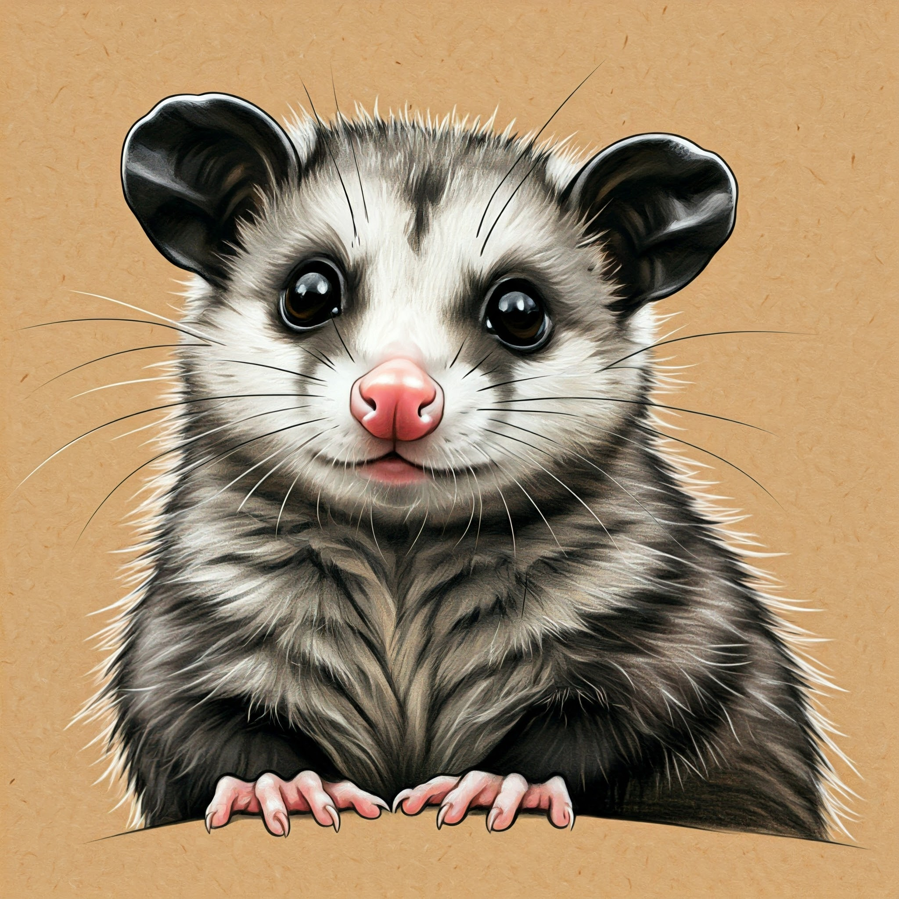

# possum [](https://github.com/shayne-fletcher/possum/actions/workflows/build-and-test.yml)

[rustdoc docs](https://shayne-fletcher.github.io/possum/bin/doc/possum/index.html)
```
Usage: possum [COMMAND]

Commands:
  model  Do things with 🤗 models
  help   Print this message or the help of the given subcommand(s)

Options:
  -h, --help     Print help
  -V, --version  Print version
```


