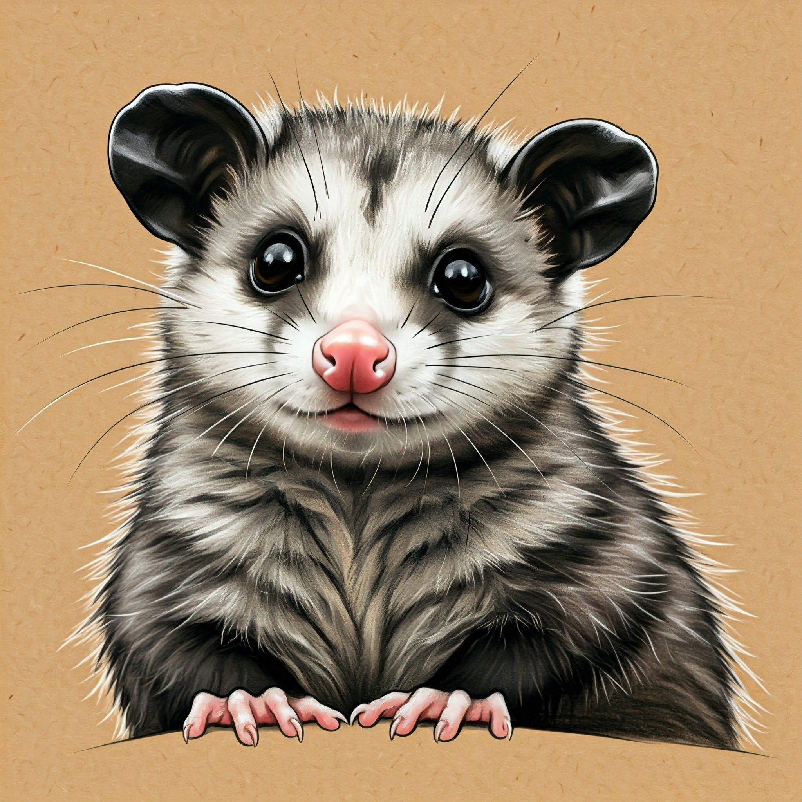

<p align="center">
  
</p>
<h1 align="center">possum</h1>
<p align="center">
  fetch hugging face model artifacts
</p>
<p align="center">
  <a href="https://github.com/shayne-fletcher/possum/actions/workflows/build-and-test.yml">
    
  </a>
  <a href="https://shayne-fletcher.github.io/possum/possum/">
    
  </a>
</p>

`possum` is a small Rust CLI for working with 🤗 model
repositories — search the hub, inspect metadata and revisions, and download
exactly the files you want.

## Commands

```text
possum model search      find repositories by keyword and filter
possum model metadata    print a repository's metadata as JSON
possum model revisions   list a repository's branches/revisions
possum model download    download selected files from a repository
```

## Downloading

Pick exactly what you need with `--include`/`--exclude` globs and bound the
parallelism with `--concurrency` (default 4):

```bash
# a DeepSeek model's weights, skipping the repo's figures
possum model download \
  --repository deepseek-ai/DeepSeek-R1-Distill-Qwen-7B \
  --include '*.safetensors' '*.json' --exclude 'figures/*'

# a single GGUF quant from a community repo
possum model download \
  --repository bartowski/DeepSeek-R1-Distill-Qwen-7B-GGUF \
  --include '*Q4_K_M.gguf'
```

A download fails loudly: any file that errors or returns a non-success
status makes the command exit non-zero, and files are streamed to a
`.incomplete` temporary and renamed on success, so an interrupted run never
leaves a truncated file behind.

## Building

```bash
cargo build                              # build
cargo test                               # the whole suite
cargo run --bin possum -- model --help   # explore the CLI
```
